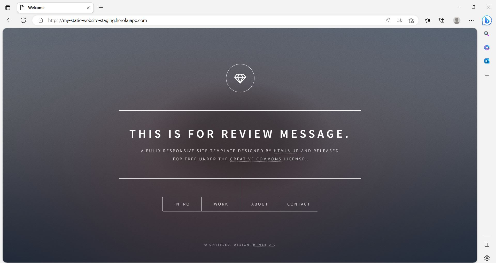

#  Mini project Jenkins 

Ce projet a pour but de mettre en pratique les connaissances de mise en place d'un pipeline CI/CD avec Jenkins afin d'automatiser les étapes de build, de test et de deploiement d'une application web statique en staging et prod sur un environnement Cloud Heroku. Ce rapport explique les étapes du pipeline sous un fichier _`Jenkinsfile`_ ainsi que les avantages de cette approche.

## Aperçu du pipeline 

## Workflow du pipeline

- **Build image**
    - _Condition_ : S'éxecute pour chaque commit sur la branche principale.
    - Construit l'image Docker de l'application en utilisant le Dockerfile crée ci - dessus.

- **Test image**
    - _Condition_ : S'éxecute pour chaque commit sur la branche principale.
    - Effectue des tests d'acceptance de l'image Docker buildée en lançant une requête HTTP afin de vérifier le contenu.

- **Scan image with SNYK**
    - _Condition_ : S'éxecute pour chaque commit sur la branche principale.
    - Effectue un scan de vulnérabilités de l'image buildée.

- **Clean container**
    - _Condition_ : S'éxecute pour chaque commit sur la branche principale.
    - Arrête et supprime le conteneur créé.

- **Login to Docker Hub**
    - _Condition_ : S'éxecute pour chaque commit sur la branche principale.
    - Se connecte sur le Docker Hub.

- **Push image to Docker Hub**
    - _Condition_ : S'éxecute pour chaque commit sur la branche principale.
    - Envoie l'image buildée sur le Docker Hub.

- **Push image in staging and deploy it**
    - _Condition_ : S'éxecute pour chaque commit sur la branche principale.
    - Déploie l'application sur un environnement de préproduction (staging) sur Heroku.

- **Push image in production and deploy it**
    - _Condition_ : S'éxecute pour chaque commit sur la branche principale.
    - Déploie l'application sur un environnement de production sur Heroku.

- **Slack Notification**
    - _Condition_ : S'éxecute pour chaque commit sur la branche principale.
    - Utilise une librairie partagée afin d'envoyer une notification sur Slack de l'état du pipeline en cours.
    
## Explications détaillées du pipeline
 
### Build image
Le dockerfile présent ci - dessus a été utilisé afin de builder l'image de l'application web statique et la déployer sur un serveur Nginx. Ce Dockerfile utilise une image _`nginx:alpine`_ permettant d'avoir une image buildée très légère n'incluant que le strict nécessaire et ainsi d'améliorer la rapidité de build. Ensuite, l'image buildée est éxecutée sur un conteneur Docker. 

### Scan image with SNYK
Un scan de l'image buildée est effectué avec Snyk, un outil d'analyse de sécurité, de vulnérabilités et d'autorémédiation au moment de la construction d'une image Docker. Ce outil permet d'intégrer une démarche DevSecOps.
 
### Test image
Un test d'acceptance sera effectué sur l'image Docker buildée.
 
### Clean container
Nous arrêtons et supprimons le conteneur créée.

### Login to Docker Hub
Nous nous connectons à notre registre Docker Hub avec les identifiants passées dans une variable d'environnement.

### Push image to Docker Hub
Une release de l'image buildée est faite sur le registre du Docker Hub.

### Push image in staging and deploy it
L'image buildée est poussé sur Heroku pour un déploiement sur un environnement de staging.  

### Push image in production and deploy it
L'image buildée est poussé sur Heroku pour un déploiement sur un environnement de production. 

### Slack Notification

Une notification Slack est envoyé à chaque fois que l'éxecution du pipeline CI/CD sera terminée.

 
## Aperçu du site 
 

 
## Technologies utilisées
 
- Docker : Conteneurisation de l'application afin de faciler le déploiement.
- Jenkins : Automatisation des étapes de build, test, scan et déploiement de l'application.
- Heroku : Hébergement de l'application dans des environnements Cloud Heroku (staging et production).
 
# Conclusion
En mettant en place ce pipeline CI/CD pour l'application web statique, j'ai pu automatiser les étapes de build, de test et de déploiement permettant de garantir que notre application est testée et fonctionnelle avant d'être mis en production et envoyé chez le client. L'utilisation des outils comme Docker et Jenkins a facilité la gestion des environnements et des déploiements, offrant un moyen efficace et sûr de mettre à jour et maintenir notre application.
